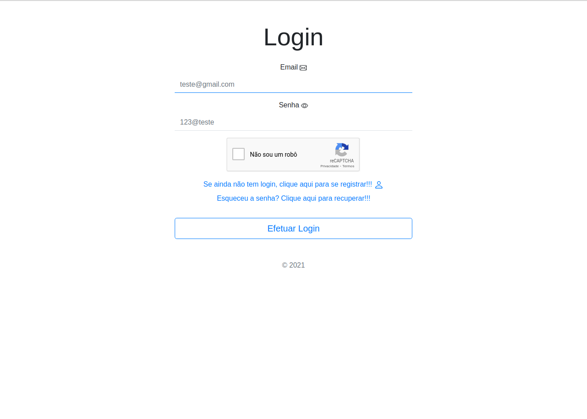
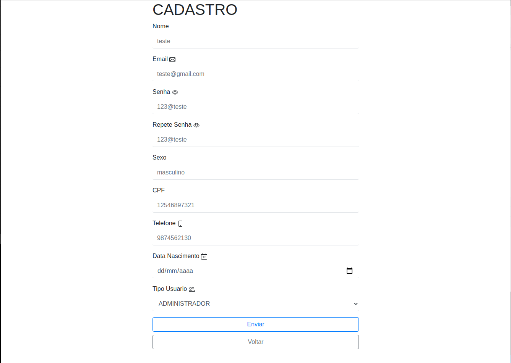
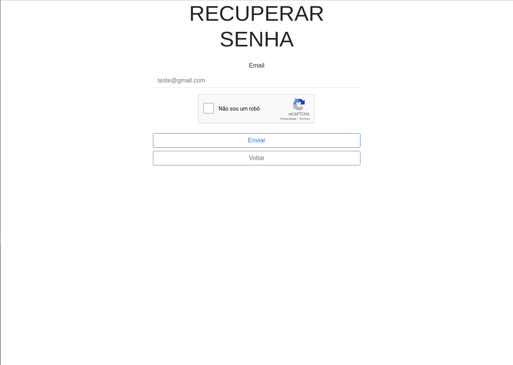
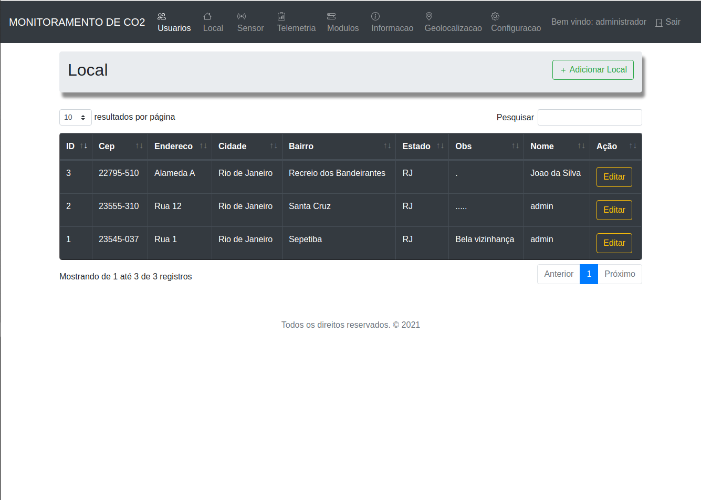
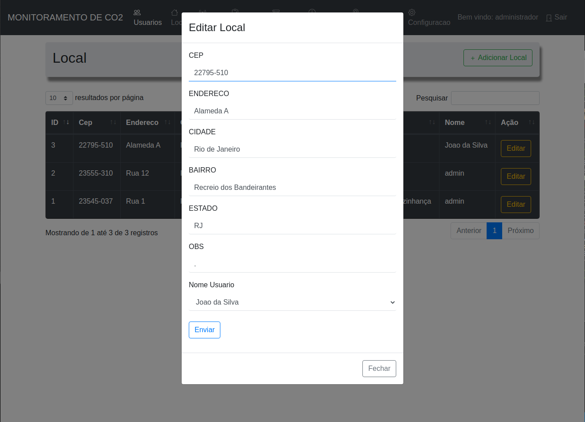
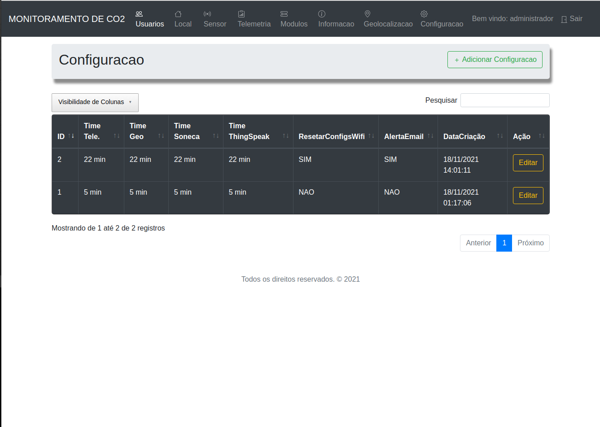
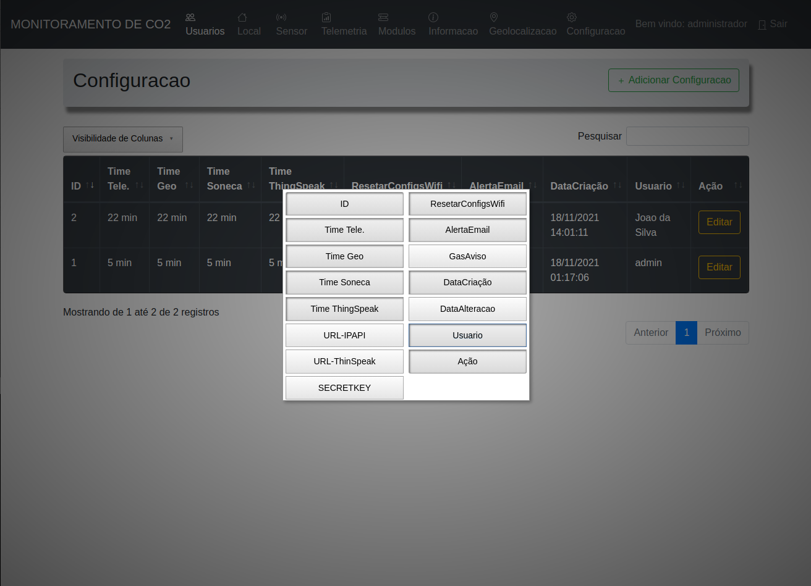
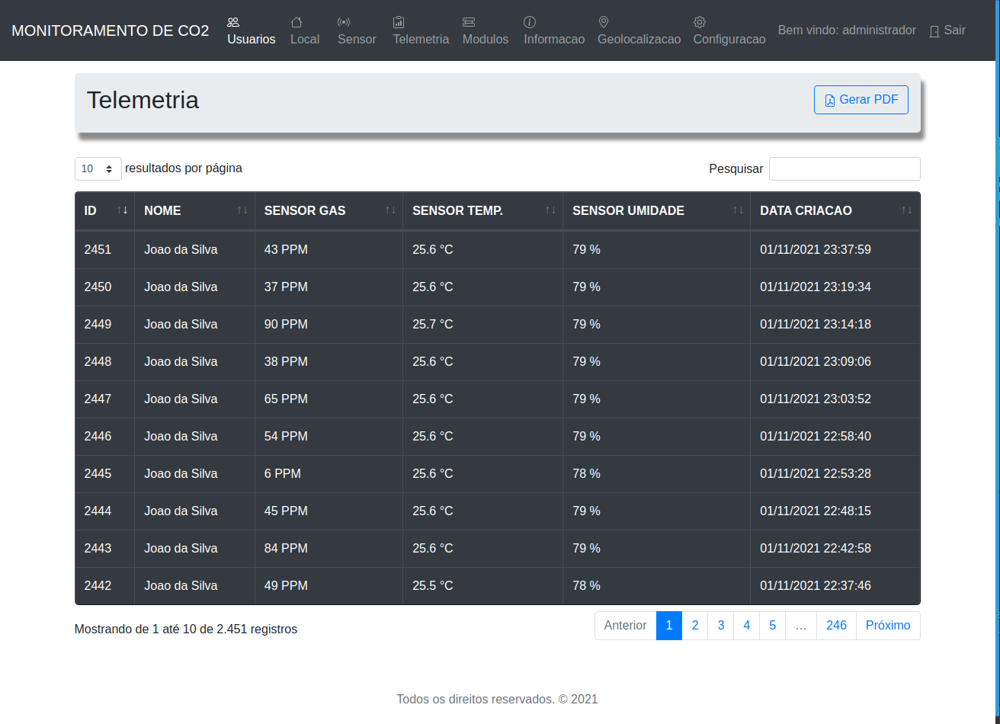
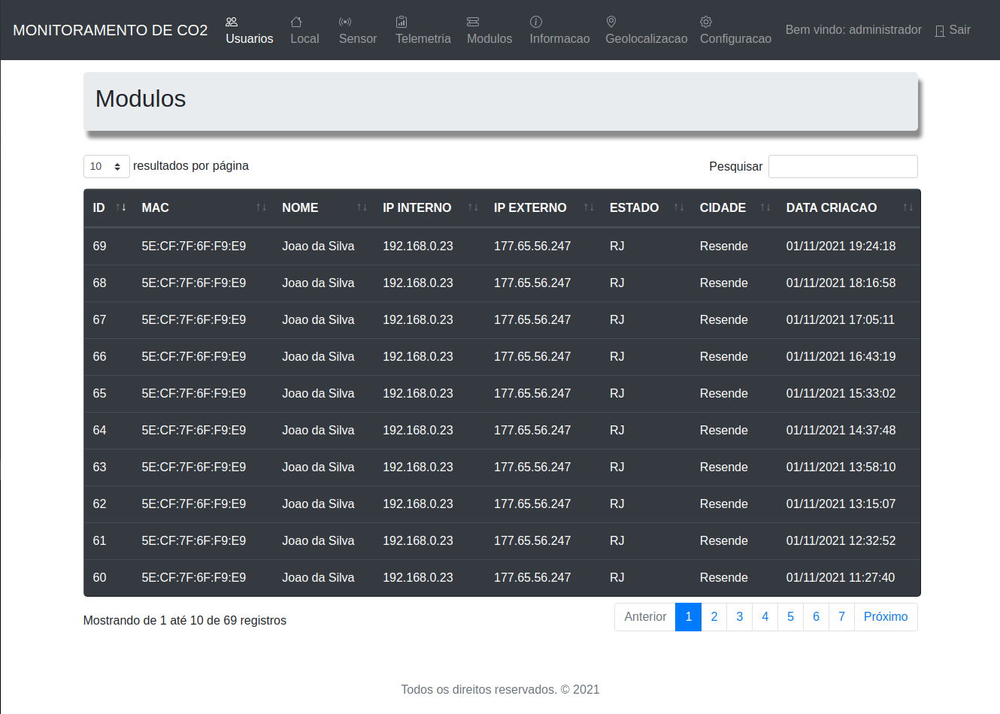
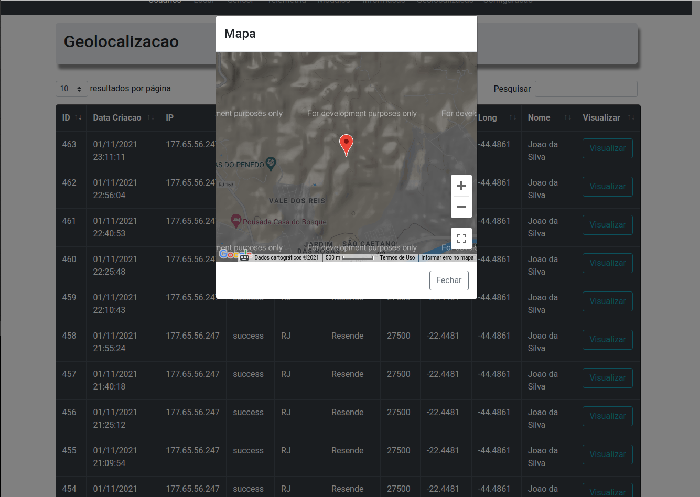

<h2> SISTEMA DE MONITORAMENTO DE GAS E QUALIDADE DO AR COM ESP8266 </h2>

<!-- <h3> Feito com carinho, usando as stacks abaixo. </h3> -->

  

  

 

 
  

  
  
  

  

##

 

<h4> O que é o projeto? </h4>

 Projeto visa evitar acidentes domesticos ou em casos extremos mortes por inalaçao de gases toxicos em ambientes fechados. 
    Usamos o ESP8266 onde nele temos sensores de temperatura/umidade e sensor MQ135(estamos usando esse no momento mas podemos usar outro da mesma familia) 
    que irao notificar o usuario seja atraves de email, telegram ou ate mesmo dentro do proprio sistema web, num futuro pode se integrar para notificar os 
    bombeiros e/ou companhia de gas sobre o possivel vazamento e tambem integrar ao quadro geral para o desligamento temporario da força(energia eletrica).

##

<h2> Principais funcionalidades </h2>

 

<h4> TELA DE LOGIN </h4>

 Na tela de LOGIN o usuario podera realizar as seguintes açoes abaixo. 

<ul>

<li> Efetuar login caso ja tenha um usuario cadastrado. </li>
<li> Realizar cadastro de login caso ainda nao tenha. </li>
<li> Recuperar a senha caso tenha esquecido. </li>
<li> Validar recaptcha antes de fazer login. </li>

</ul>

##

<h4> TELA DE CADASTRO DE USUARIO </h4>

 Na tela de CADASTRO o usuario podera realizar as seguintes açoes abaixo. 

<ul>

<li> Cadastrar um login para acesso ao sistema. </li>
<li> Caso o usuario escolha o tipo de perfil 'administrador' e caso ja tenha um 'administrador' no sistema uma mensagem de erro ira aparecer. </li>
<li> Voltar pra pagina de login para acessar o sistema. </li>

</ul>

##

<h4> TELA DE RECUPERAR SENHA </h4>

 Na tela de RECUPERAR SENHA o usuario podera realizar as seguintes açoes abaixo. 

<ul>

<li> Validar o email ja cadastrado no sistema para que possa seguir as instruçoes para recuperaçao da senha. </li>
<li> Validar o recaptcha. </li>
<li> Voltar para pagina de login. </li>

</ul>

## 

<h4> TELA DE LOCAL </h4>

 

 Na tela de LOCAL o usuario podera realizar as seguintes açoes abaixo. 

<ul>

<li> Efetuar cadastro de um ou mais locais. </li>
<li> Editar registro de um ou mais locais. </li>
<li> Visuaizar os cadastros efetuados. </li>
<li> Excluir cadastro de um ou mais locais. </li>
<li> Filtro de registros referente aos locais. </li>
<li> Ao digitar o cep o sistema faz um consumo na API do ViaCEP para validaçao em caso de encontrar o cep do usuario o sistema fara preenchimento de forma automatica nos inputs. </li>

</ul>

## 

<h4> TELA DE CONFIGURAÇOES </h4>

 

 Na tela de CONFIGURAÇOES o usuario podera realizar as seguintes açoes abaixo. 

<ul>

<li> Efetuar cadastro de um ou mais configuraçoes. </li>
<li> Editar registro de um ou mais configuraçoes. </li>
<li> Visuaizar os cadastros efetuados. </li>
<li> Excluir cadastro de um ou mais configuraçoes. </li>
<li> Filtro de registros referente a configuraçoes. </li>
<li> Ao clicar no botao de Visibilidade de colunas o usuario podera escolher quais colunas ele quer ver, alem dessa opçao ser boa para que nao haja estouro da tabela em tela deixando o layout com um padrao e estetica boa.

</ul>

## 

<h4> TELA DE TELEMETRIA </h4>

 Na tela de TELEMETRIA o usuario podera realizar as seguintes açoes abaixo. 

<ul>

<li> Visualizar os registros do ambiente do local, campos como temperatura/umidade e gas(PPM - partes por milhao) serao exibidos e atualizados de forma automatica pelo sistema. </li>
<li> Filtrar os registros de telemetria. </li>
<li> Gerar relatorios PDF's.  </li>

</ul>

## 

<h4> TELA DE MODULOS </h4>

 Na tela de MODULOS o usuario podera realizar a seguinte açao abaixo. 

<ul>

<li> Visualizar os modulos cadastrados no sistema, cadastrados de forma automatica nessa tela. </li>
<li> Filtrar registros de modulos. </li>

</ul>

## 

<h4> TELA DE GEOLOCALIZAÇAO </h4>

 Na tela de GEOLOCALIZAÇAO o usuario podera realizar as seguintes açoes abaixo. 

<ul>

<li> Visualizar os registros de geolocalizaçao. </li>
<li> Ao clicar no botao visualizar o usuario ira ver um modal com o maps carregado apontando assim a localizaçao aproximada do modulo. </li>
<li> Filtrar os registros de geolocalizaçao. </li>

</ul>

## 

<!-- 
<h4> TELA DE LGOIN </h4>

 Na tela de LOGIN o usuario podera realizar a seguinte açao abaixo. 

<ul>

<li> Efetuar login caso ja tenha um usuario cadastrado. </li>
<li> Realizar cadastro de login caso ainda nao tenha. </li>
<li> Recuperar a senha caso tenha esquecido. </li>
<li> Validar recaptcha antes de fazer login. </li>

</ul>

## 

<h4> TELA DE LGOIN </h4>

 Na tela de LOGIN o usuario podera realizar a seguinte açao abaixo. 

<ul>

<li> Efetuar login caso ja tenha um usuario cadastrado. </li>
<li> Realizar cadastro de login caso ainda nao tenha. </li>
<li> Recuperar a senha caso tenha esquecido. </li>
<li> Validar recaptcha antes de fazer login. </li>

</ul>

## 
 -->

